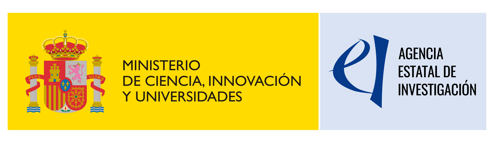

::: {.callout-note appearance="simple" icon=false}
**Status** · Active
**Duration** · September 2026 -- August 2029 (3 years)
**Reference** · PID2025-168467NB-I00
**Call** · Proyectos de Generación de Conocimiento, Ministry of Science, Innovation and Universities (MICIU) / State Research Agency (AEI)
**Principal Investigator** · Carlos Rey-Castro
**Host institution** · University of Lleida
:::

## Summary

WASABI develops and integrates chemical speciation techniques with mechanistic
modelling to better predict how trace metals and phosphorus behave, and become
available to organisms, in waters and soils. The project combines two
complementary electroanalytical and passive-sampling methods -- *Absence of
Gradients and Nernstian Equilibrium Stripping* (AGNES) and *Diffusive
Gradients in Thin Films* (DGT) -- with numerical simulations to build models
that can be applied to real, complex environmental matrices such as
wastewater and agricultural soils.

## Objectives

- **O1.** Build a panel of representative model systems for the speciation of
  trace metals, dissolved organic matter (DOM), and phosphorus.
- **O2.** Advance AGNES-based methods for equilibrium speciation, including
  low-volume implementations.
- **O3.** Develop advanced DGT methods for assessing metal and phosphorus
  availability in waters.
- **O4.** Implement DGT/DET approaches to study metal and phosphorus dynamics
  in soils.
- **O5.** Integrate multiscale mechanistic models of dynamic speciation and
  chemical availability.

## Approach

The project combines experimental and computational work across five work
packages: characterisation of model systems (isolation and characterisation
of soil-derived organic matter, determination of equilibrium and kinetic
constants), equilibrium speciation by AGNES, dynamic speciation by DGT in
waters -- including field validation at a municipal wastewater treatment
plant in Lleida -- DGT/DET applications in agricultural soils, and mechanistic
modelling linking molecular simulations, affinity-spectrum analysis, and
reaction-diffusion models.

## Collaborators

- Amphos 21 Consulting, Spain
- Università di Messina, Italy
- Vrije Universiteit Brussel, Belgium

## Funding

Funded by MICIU/AEI/10.13039/501100011033, grant PID2025-168467NB-I00.
